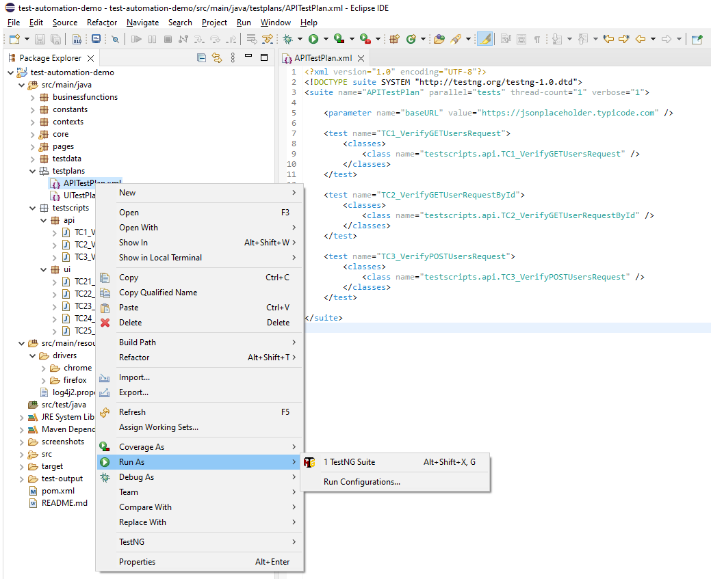

prerequisite
==================================
1. Java
2. Maven
3. Eclipse with TestNG plugin installed

Building & Running
==================================
### Build
 1. Download or clone the project source code from https://github.com/BathiyaL/test-automation-demo

 2. If you are open the project from an IDE (e.g. Eclipse) import project as a Maven project and do a force Maven update

### Run with Eclipse TestNG plugin

1. To Run a single Test go to src/main/java/testscripts/api package and run the test (e.g. TC1_VerifyGETUsersRequest.java) as TestNG Test

2. To Run a TestNG xml go to src/main/java/testplans package and run the xml (e.g. UITestPlan.xml) as TestNG Suite

Committing Code
==================================
- main branch : Contains tests that can run on production
- dev branch : Contains all development level tests

### Pull Requests
- You should push your local changes to your forked GitHub repository and then open a pull request(PR) from your repo to the BathiyaL/tmsandbox-api-tests repository.
- The PR should be from your repository to the appropriate branch in the BathiyaL/test-automation-demo repository.

